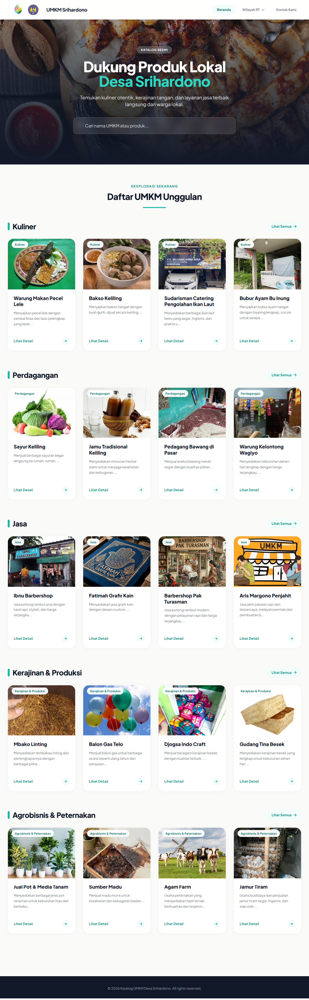
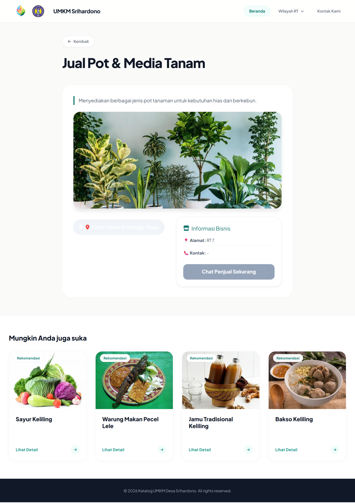
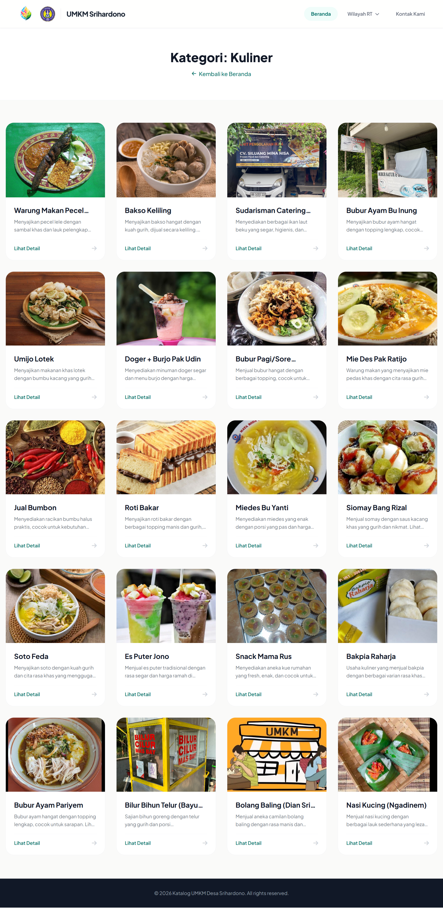

# UMKM Blogger Theme

Modern Blogger theme for village UMKM catalogs and local business directories.

Designed for community marketplaces, village business showcases, KKN projects, and local product directories with a clean modern UI and responsive experience.

---

# Preview

## Homepage



---

## Single Post View



---

## Category View



---

# Features

- Responsive Design
- Modern UI
- Dynamic UMKM Card Layout
- Auto Category Section
- Hero Slider
- Google Maps Integration
- SEO Friendly
- Fast Loading
- Mobile Friendly
- Clean Layout
- Blogger Native Compatible

---

# Included Files

```bash
theme/
└── theme-umkm.xml

post-template/
└── post-template-umkm.html
```
````

---

# Installation

## Install Theme

1. Open Blogger Dashboard
2. Go to **Theme**
3. Backup your current theme
4. Click **Restore**
5. Upload:

```bash
theme-umkm.xml
```

---

## Install Post Template

Open file:

```bash
post-template/post-template-umkm.html
```

Copy all contents, then paste into Blogger Post Editor using **HTML View**.

---

# 🛠 Customization

## Change Logo

Search:

```html

```

Replace with your own logo URL.

---

## Change Village Name

Search:

```html
UMKM Srihardono
```

Replace with your own village or business name.

---

## Change Hero Images

Search:

```javascript
const heroImages = [...]
```

Replace image URLs with your own images.

---

# Repository Structure

```bash
umkm-blogger-theme/
│
├── README.md
│
├── theme/
│   └── theme-umkm.xml
│
├── post-template/
│   └── post-template-umkm.html
│
└── preview/
    ├── homepage.png
    ├── single-post.png
    └── kategori-view.png
```

---

# Responsive Support

| Device  | Support |
| ------- | ------- |
| Desktop | ✅      |
| Tablet  | ✅      |
| Mobile  | ✅      |

---

# Optimization

- Lazy Load Image
- Lightweight Layout
- Smooth Animation
- Optimized DOM Structure

---

# Best Use Cases

- Village UMKM Catalog
- KKN Project
- Community Marketplace
- Local Business Directory
- Product Showcase
- Digital Village Website

---

# Credits

Developed by HN Sidik

Feel free to modify and use this template for personal, educational, or community projects.

```

```
